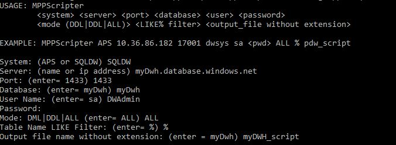

# Introduction

DWScripter is a scripting tool for Analytics Platform System and Azure SQLDW. This Console app will script the ddl and dml for both APS and SQLDW.
Supports: PDW V2, Azure SQLDW, DDL and DML, schemas (version 2.4)

## Getting Started

Download the DWScripter executable and run it in a command prompt or PowerShell window.
DWScripter requires some paramters to identify the instance and databases to be scripted, as well as the object (DML, DDL or both).
You can invoke DWScripter by passing all paramters, or use it in interactive mode by executing DWScripter.exe. DWScripter will prompt for any required information.
Output file(s) will be placed in the same folder where DWScripter is being executed from.

## Current version is 1.0.0

### USAGE

    DWScripter <system> <server> <port> <database> <user> <password> <mode (DDL|DML|ALL)> <LIKE% filter> <output_file without extension>

### Examples

#### Analytics Platform System

    DWScripter.exe APS 10.36.86.182 17001 dwsys sa <pwd> ALL % pdw_script

#### Azure SQL Data Warehouse

    DWScripter.exe SQLDW mydb.windows.database.net 1433 mydb sa <pwd> ALL % dw_script

#### Interactive mode

## Contributing

If you are interested in fixing issues and contributing directly to the code base please see [contributing guidelines](./CONTRIBUTING.md)

Please also review our [Code of Conduct](https://opensource.microsoft.com/codeofconduct/).

## Reporting Security Issues

Security issues and bugs should be reported privately, via email, to the Microsoft Security
Response Center (MSRC) at [secure@microsoft.com](mailto:secure@microsoft.com). You should
receive a response within 24 hours. If for some reason you do not, please follow up via
email to ensure we received your original message. Further information, including the
[MSRC PGP](https://technet.microsoft.com/en-us/security/dn606155) key, can be found in
the [Security TechCenter](https://technet.microsoft.com/en-us/security/default).
